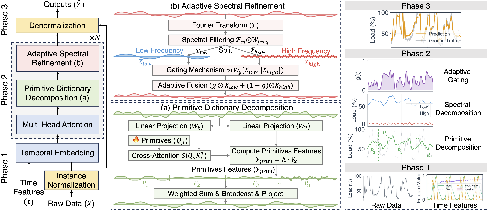

# PRISM: Dynamic Primitive-Based Forecasting for Large-Scale GPU Cluster Workloads

[](https://www.python.org/)
[](https://pytorch.org/)
[](LICENSE)

> **PRISM** is a dynamic primitive-based forecasting framework for large-scale GPU cluster workloads. It decomposes complex GPU demand signals into learnable primitives, enabling accurate multi-horizon forecasting across total demand, job priority, and organization dimensions.

## Architecture



## Installation

### Requirements

```
Python >= 3.8
PyTorch >= 2.0.0
CUDA >= 11.0 (for GPU support)
```

### Install Dependencies

```bash
pip install -r requirements.txt
```

Or manually:

```bash
pip install torch>=2.0.0 torchvision torchaudio
pip install pandas numpy scikit-learn
pip install matplotlib seaborn tqdm
```

### Clone Repository

```bash
git clone https://github.com/wuliwuxin/PRISM.git
cd PRISM
```

## 🎯 Quick Start

### 1. Prepare Data

Place your data files in `data/`:
```
data/
├── node_info_df.csv
└── job_info_df.csv
```

### 2. Run Experiments

#### Default Configuration (Total GPU Demand)
```bash
chmod +x run_experiments.sh
./run_experiments.sh
```

#### Priority Mode (HP vs Spot)
```bash
./run_experiments.sh --mode priority
```

#### Organization Mode
```bash
./run_experiments.sh --mode organization
```

### 3. Custom Configuration
```bash
./run_experiments.sh \
    --mode total \
    --seeds 42 2024 \
    --pred-lens 24 48 \
    --gpus 0 1 \
    --epochs 100 \
    --batch-size 128
```

## Configuration

- **Multiple Prediction Modes**:
  - `total`: Overall GPU demand prediction
  - `priority`: Separate predictions for High-Priority (HP) and Spot jobs
  - `organization`: GPU demand by different organizations

### Command Line Arguments

```bash
--mode MODE              # Prediction mode: total/priority/organization
--seeds SEED...          # Random seeds (default: 42 2024 123456 2025 2026)
--pred-lens LEN...       # Prediction lengths in hours (default: 6 12 24 48)
--gpus GPU...            # GPU IDs (default: 0 1)
--epochs N               # Training epochs (default: 100)
--batch-size N           # Batch size (default: 128)
```

### Python Configuration

```python
from config import create_custom_config

config = create_custom_config(
    prediction_mode='priority',
    seeds=[42, 2024, 123456],
    pred_lens=[6, 12, 24, 48],
    gpu_ids=[0, 1],
    epochs=100,
    batch_size=128,
    d_model=256,
    n_primitives=16
)
```

## 🎯 Prediction Modes

### 1. Total Mode (`--mode total`)
Predicts overall GPU demand across all jobs.

**Output**: Single time series of total GPU usage

**Use Case**: Overall capacity planning

### 2. Priority Mode (`--mode priority`)
Separates predictions by job priority (High-Priority vs Spot).

**Output**: Two time series (HP and Spot GPU demands)

**Use Case**: Priority-based resource allocation

### 3. Organization Mode (`--mode organization`)
Predicts GPU demand for top N organizations separately.

**Output**: Multiple time series (one per organization + others)

**Use Case**: Department-level resource planning

## Usage Examples

### Example 1: Basic Training
```python
from main import main
from config import ExperimentConfig

# Use default configuration
config = ExperimentConfig()
main(config)
```

### Example 2: Priority Prediction
```python
from main import main
from config import create_custom_config

config = create_custom_config(
    prediction_mode='priority',
    seeds=[42, 2024],
    pred_lens=[24, 48],
    gpu_ids=[0]
)

main(config)
```

### Example 3: Quick Test
```python
from main import main
from config import create_custom_config

config = create_custom_config(
    seeds=[42],
    pred_lens=[24],
    epochs=10,  # Quick test
    batch_size=64
)

main(config)
```

## 📊 Results & Visualization

### Saved Files

#### Results (CSV)
- `results/prism_total_results.csv` - Main experiment results
- `results/prism_priority_results.csv` - Priority mode results
- `results/prism_organization_results.csv` - Organization mode results

#### Predictions (NumPy)
- `predictions/*_predictions.npy` - Model predictions
- `predictions/*_targets.npy` - Ground truth
- `predictions/*_predictions_norm.npy` - Normalized predictions
- `predictions/*_targets_norm.npy` - Normalized ground truth

#### Visualizations
- `visualizations/*_waveform.png` - Time series comparison
- `visualizations/*_scatter.png` - Scatter plot with error distribution
- `visualizations/metrics_comparison.png` - Performance metrics

#### Models
- `checkpoints/prism_*_seed*_predlen*.pth` - Trained models

### Metrics Reported

**Normalized Space** (for model comparison):
- MSE, MAE, RMSE

**Original Scale** (for interpretation):
- MAE (GPUs)
- RMSE (GPUs)
- MAPE (%)
- R² Score

### Loading and Visualizing Predictions

```python
import numpy as np
import matplotlib.pyplot as plt

# Load predictions
predictions = np.load('predictions/prism_total_seed42_predlen24_predictions.npy')
targets = np.load('predictions/prism_total_seed42_predlen24_targets.npy')

# Plot
plt.figure(figsize=(15, 5))
plt.plot(targets[:500], label='Ground Truth', alpha=0.8)
plt.plot(predictions[:500], label='Predictions', alpha=0.8)
plt.legend()
plt.xlabel('Time Step')
plt.ylabel('GPU Demand')
plt.title('Prediction vs Ground Truth')
plt.show()
```

## Data

Place your data files in `data/`:

| File | Description | Source |
|------|-------------|--------|
| `node_info_df.csv` | GPU node hardware information | [HeliosData](https://github.com/S-Lab-System-Group/HeliosData) |
| `job_info_df.csv` | Job submission and resource records | [HeliosData](https://github.com/S-Lab-System-Group/HeliosData) |

> Note: `job_info_df.csv` is large (~23MB) and excluded from this repository. Download it from the dataset links above.

## File Structure

```
PRISM/
├── config.py                    # Configuration management
├── data_processor.py            # Multi-mode data processing
├── model.py                     # PRISM model architecture
├── metrics.py                   # Evaluation metrics
├── train.py                     # Training & evaluation
├── main.py                      # Main experiment script
├── quickstart.py                # Quick-start demo
├── visualize.py                 # Visualization utilities
├── run_experiments.sh           # Automated experiment runner
├── requirements.txt             # Python dependencies
├── README.md                    # This file
│
├── data/                        # Input data (download separately)
│   ├── node_info_df.csv
│   └── job_info_df.csv
│
├── Figure/                      # Architecture figures
│   └── Model.png
│
├── checkpoints/                 # Saved model weights (auto-created)
│   └── *.pth
│
├── results/                     # Experiment results (auto-created)
│   └── prism_*_results.csv
│
├── predictions/                 # Saved predictions (auto-created)
│   ├── *_predictions.npy
│   └── *_targets.npy
│
└── visualizations/              # Generated plots (auto-created)
    └── *.png
```

## Advanced Usage

### Custom Model Configuration

```python
from model import PRISM

model = PRISM(
    seq_len=96,           # 4 days input
    pred_len=24,          # 24 hours forecast
    use_patch=True,
    patch_len=16,
    stride=8,
    d_model=512,          # Larger model
    n_heads=8,
    e_layers=3,
    d_ff=2048,
    n_primitives=32,      # More primitives
    dropout=0.1
)
```

### Multi-GPU Training

```python
# Automatically distributes experiments across GPUs
config = create_custom_config(
    gpu_ids=[0, 1, 2, 3],  # 4 GPUs
    seeds=[42, 2024, 123456, 2025, 2026],  # 5 seeds
    pred_lens=[6, 12, 24, 48]  # 4 lengths
)
# Total: 20 experiments distributed across 4 GPUs
```

### Load and Evaluate Saved Model

```python
import torch
from model import PRISM

# Load model
checkpoint = torch.load('checkpoints/prism_total_seed42_predlen24.pth')

model = PRISM(seq_len=96, pred_len=24, d_model=256, n_primitives=16)
model.load_state_dict(checkpoint['model_state_dict'])
model.eval()

# Make predictions
with torch.no_grad():
    predictions, _ = model(x, hours, days, months, is_weekend)
```

## Citation

If you find this work useful, please consider citing our paper:

```bibtex
@inproceedings{WuPrism2026,
  title={PRISM: Dynamic Primitive-Based Forecasting for Large-Scale GPU Cluster Workloads},
  author={Wu, Xin and Teng, Fei and Li, Xingwang and Zheng, Bin and Duan, Qiang},
  booktitle={Proceedings of the 63rd ACM/EEE Design Automation Conference (DAC‘26)},
  year={2026}
}
```
## Contact

If you have any questions or want to use the code, please contact wu1351658806@163.com.

## Acknowledgement

We appreciate the following github repos a lot for their valuable code base or datasets:

https://github.com/S-Lab-System-Group/HeliosData

https://github.com/Azure/AzurePublicDataset/

https://github.com/GestaltCogTeam/BasicTS

https://github.com/thuml/Time-Series-Library

https://github.com/MachineLearningSystem/26ASPLOS-Spot

https://github.com/EdgeBigBang/KDD25_MetaEformer


## Contributing

Contributions welcome! Please open an issue or submit a pull request.

